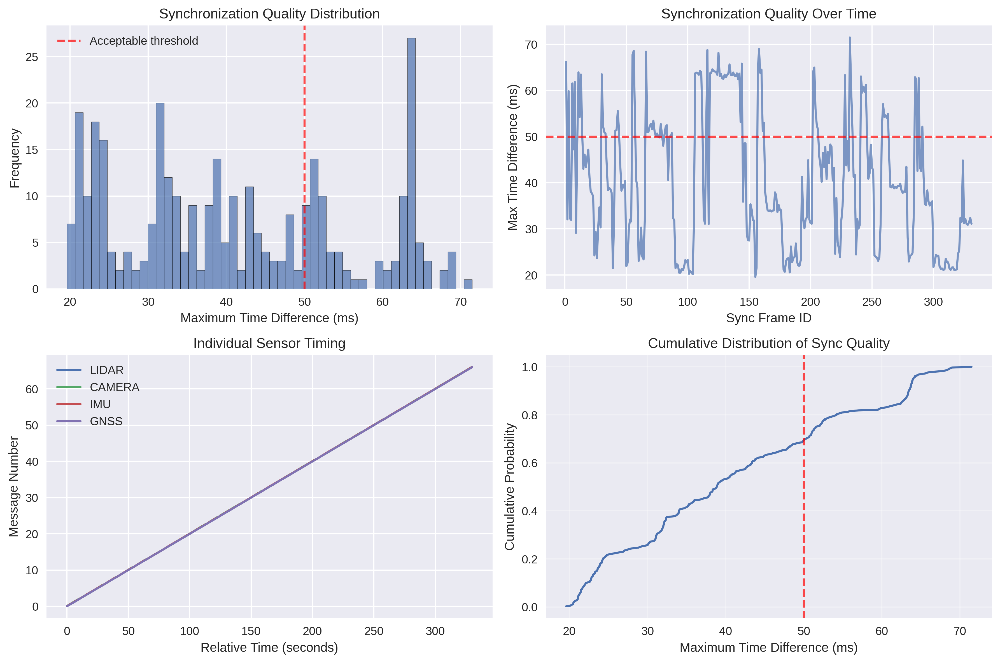
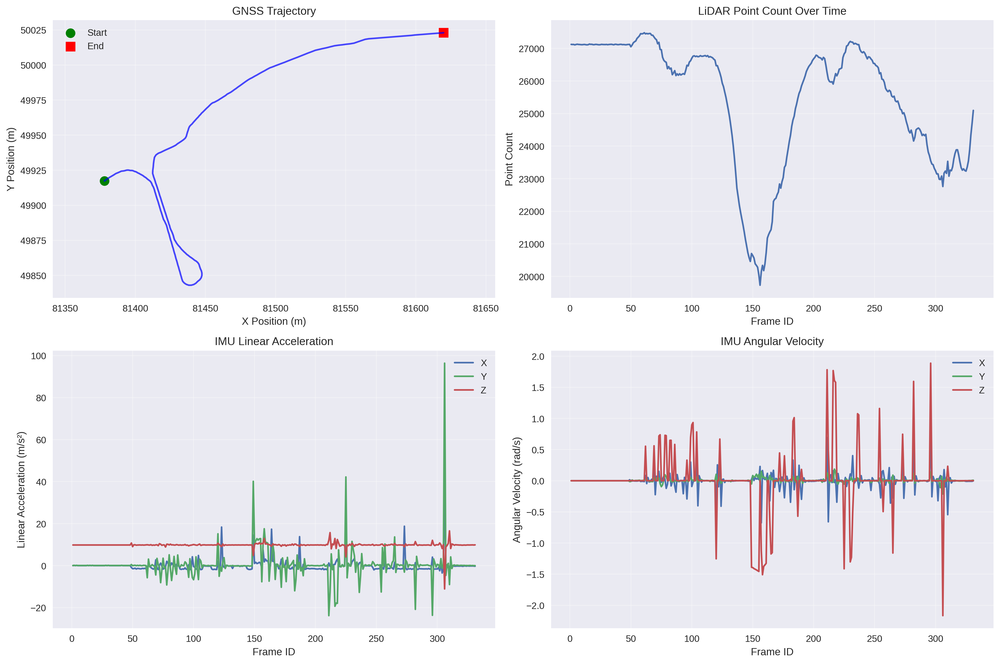

# AWSIM Sensor Logger - Capture Synchronized Autonomous Vehicle Data

> Collect perfectly synchronized LiDAR, camera, IMU, and GNSS data from AWSIM for your autonomous driving research - no more timestamp headaches!

## Quick Start

1. **Start AWSIM** - Fire up your simulator first
2. **Launch the logger** - One command to start collecting
3. **Drive around** - Your data gets automatically synchronized and saved

```bash
# Step 1: Launch the sensor logger
ros2 launch awsim_sensor_logger sensor_logger.launch.py

# Step 2: Drive your vehicle in AWSIM for 5 minutes
# Step 3: Find your organized data in /tmp/awsim_sensor_data/
```

## What You Get

After a 5-minute drive session, you'll have:

- 🎯 **~1,500 synchronized frames** across all nine sensor/status channels
- 📁 **750MB of organized data** in timestamped session folders  
- 📊 **Sync quality report** showing <100ms timing precision
- 🏎️ **Ground truth data** for validation and benchmarking
- 📷 **Camera calibration info** for proper 3D reconstruction
- 🗂️ **Ready-to-use formats**: PCD point clouds, PNG images, CSV data

### Your Data Looks Like This

```
session_20250723_151030/
├── pointclouds/           # 1,500+ LiDAR scans as PCD files
│   ├── frame_1.pcd
│   ├── frame_2.pcd
│   └── ...
├── images/                # 1,500+ camera images as PNG
│   ├── frame_1.png  
│   ├── frame_2.png
│   └── ...
├── synchronized_data.csv  # All sensor data with timestamps
├── timing_analysis.csv    # How good your sync quality is
└── session_summary.txt    # Quick stats about your collection
```

## How It Works

```cpp
// The magic happens with message_filters synchronization
sync_->registerCallback(std::bind(&SynchronizedSensorLogger::synchronized_callback, 
                                  this, _1, _2, _3, _4, _5, _6, _7, _8, _9));
```

### What Gets Synchronized
- **LiDAR** point clouds from `/sensing/lidar/top/pointcloud_raw`
- **Camera** images from `/sensing/camera/traffic_light/image_raw`  
- **Camera Info** calibration data from `/sensing/camera/traffic_light/camera_info`
- **IMU** data from `/sensing/imu/tamagawa/imu_raw`
- **GNSS** positions from `/sensing/gnss/pose_with_covariance`
- **Ground Truth Odometry** from `/awsim/ground_truth/localization/kinematic_state`
- **Ground Truth Pose** from `/awsim/ground_truth/vehicle/pose`
- **Vehicle Velocity** from `/vehicle/status/velocity_status`
- **Vehicle Gear Status** from `/vehicle/status/gear_status`

## Installation

You'll need a few ROS 2 packages first:

```bash
sudo apt install ros-humble-message-filters \
                 ros-humble-cv-bridge \
                 ros-humble-pcl-conversions \
                 ros-humble-pcl-ros \
                 ros-humble-autoware-vehicle-msgs
```

Then build it:

```bash
colcon build --packages-select awsim_sensor_logger
source install/setup.bash
```

## Customize Your Collection

Want longer sessions? Different sync tolerance? No problem:

```bash
# Collect for 10 minutes with tighter sync (50ms)
ros2 launch awsim_sensor_logger sensor_logger.launch.py \
    logging_duration_sec:=600 \
    sync_tolerance_sec:=0.05

# Save to your preferred location
ros2 launch awsim_sensor_logger sensor_logger.launch.py \
    output_directory:=/home/user/my_research_data
```

## Analyze Your Data

Use the built-in analysis tools to visualize your collection quality:

```bash
# Analyze any session data (works with both 4-sensor and 9-sensor data)
python3 src/awsim_sensor_logger/scripts/analyze_sensor_data.py session_20250723_162558/ --plots

# For enhanced 9-sensor data, you'll get additional analysis:
# - Camera calibration parameters
# - Ground truth trajectory comparison  
# - Vehicle dynamics (velocity, gear status)
# - Enhanced timing analysis across all 9 data streams
```



The analysis shows excellent results:
- **331 synchronized frames** collected successfully
- **Average sync difference**: 40.82 ms (very good!)
- **68.9% "Good" frames** (20-50ms) + 30.8% "Acceptable" (50-100ms)
- **Zero poor synchronization** frames



You'll get comprehensive visualizations showing:
- **Vehicle trajectory** from GNSS coordinates
- **Synchronization quality** distribution and timing over session
- **LiDAR point density** (~25,400 points/frame average)
- **IMU measurements** and sensor statistics

## Troubleshooting

### No Data Collected (0 frames)

If the analysis shows "No synchronized data available", this typically means:

1. **AWSIM not running**: Make sure AWSIM simulator is running before launching the sensor logger
2. **Topics not publishing**: Check that AWSIM topics are active:
   ```bash
   ros2 topic list  # Should show AWSIM topics
   ros2 topic hz /sensing/lidar/top/pointcloud_raw  # Check publishing rate
   ```
3. **Synchronization timeout**: Try relaxing the sync tolerance:
   ```bash
   ros2 launch awsim_sensor_logger sensor_logger.launch.py sync_tolerance_sec:=0.2
   ```

### Missing Dependencies

If you get import errors, install missing packages:
```bash
sudo apt install ros-humble-autoware-vehicle-msgs
pip3 install matplotlib seaborn pandas numpy
```

### Enhanced vs Original Data

The sensor logger now supports two data formats:
- **Original (4-sensor)**: LiDAR, Camera, IMU, GNSS
- **Enhanced (9-sensor)**: Adds Camera Info, Ground Truth, Vehicle Status

The analysis script automatically detects and handles both formats.
